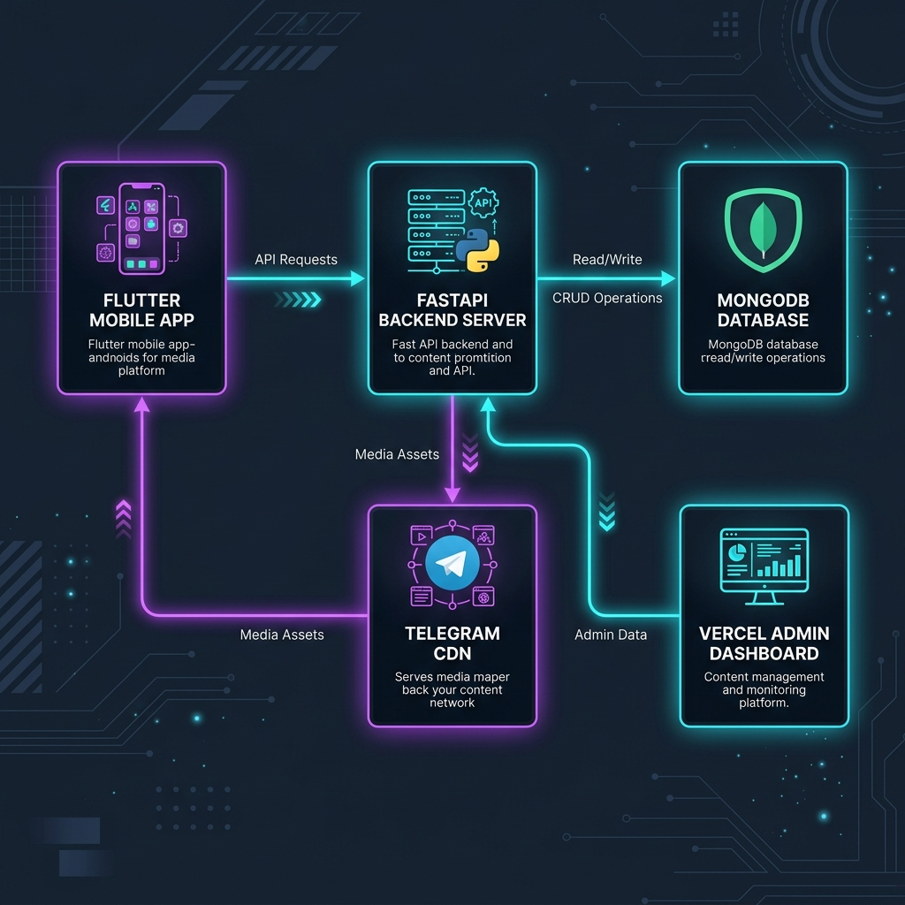

# 🚀 Infinity Stream Ecosystem
### **OTT + Live TV + Live Sports Hub + Editorial CMS News + Web Admin Dashboard**

Welcome to **Infinity Stream**, an all-in-one hybrid entertainment and media discovery ecosystem! This repository houses a production-ready, fully-integrated suite combining a high-performance **FastAPI ByteStreamer Backend**, a gorgeous standalone **Vercel Admin Panel**, and a premium **Flutter Mobile Application**!

---

## 📐 System Architecture & Flow



```mermaid
graph TD
    subgraph Client Applications
        FA[Flutter Mobile App]
        AD[Admin Web Panel - Vercel]
    end

    subgraph FastAPI Backend Gateway (Render)
        API[API Router Node]
        R_OTT[OTT Media Controller]
        R_LTV[Live TV Controller]
        R_ED[Editorial CMS Controller]
        R_SP[Sports Hub Match Scheduler]
        R_AN[Analytics Event Tracker]
        R_DL[HLS Telegram Streamer]
    end

    subgraph Storage & CDNs
        DB[(MongoDB projectS Database)]
        TG[Telegram MTProto CDN Nodes]
        TMDB[TMDB Global Database]
    end

    FA -->|REST APIs & Unified Search| API
    AD -->|Dynamic REST Operations| API
    API -->|Read/Write Session Actions| DB
    API -->|Auto Sync Metadata| TMDB
    R_DL -->|ByteStreamer Pipeline| TG
    FA -->|Play HLS m3u8 Streams| R_DL
```

---

## 📁 Repository Directory Structure

```text
.
├── Backend/
│   ├── fastapi/
│   │   ├── templates/
│   │   │   ├── index.html            <-- HLS Video Player web view
│   │   │   └── admin.html            <-- Embedded local Admin Dashboard
│   │   └── main.py                   <-- Upgraded REST Router (Live TV, Sports, CMS, Analytics, Search)
│   ├── helper/
│   │   ├── database.py               <-- Motor MongoDB pipeline & aggregators (6 new collections)
│   │   ├── modal.py                  <-- Pydantic models for validation (Channels, Fixtures, News)
│   │   └── pyro.py
│   └── config.py                     <-- Env loader with local/Render production fallback overrides
├── admin_panel_vercel/               <-- STANDALONE VERCEL ADMIN PANEL FRONTEND
│   ├── index.html                    <-- Premium Glassmorphic SPA with dynamic backend URL save
│   └── vercel.json                   <-- CORS & headers rules for serverless static hosting
├── filmsclub_flutter_app/            <-- PREMIUM FLUTTER MOBILE APP CODEBASE
│   ├── android/                      <-- Native Android gradle & build scripts
│   ├── ios/                          <-- Native Apple iOS Runner files
│   ├── lib/
│   │   ├── models/media.dart         <-- Strong type structures for Movies, TV, Channels, News, Sports
│   │   ├── providers/app_state.dart  <-- Global watchlist and resume watching progress sync
│   │   ├── screens/                  <-- High-fidelity UI layouts (spotlights, HLS chewie player)
│   │   ├── services/api_service.dart <-- Async networking interface wired directly to FastAPI endpoints
│   │   └── main.dart                 <-- Root BottomNavigationBar navigation controller
│   └── pubspec.yaml                  <-- Packages config (CachedImage, chewie, spinkit, fonts)
├── requirements.txt
├── sample_config.env
└── start.sh
```

---

## ✨ Ecosystem Core Highlights

> [!TIP]
> **🚀 Live HLS Stream testing**: The Vercel Admin Panel includes a built-in stream tester. Paste an `.m3u8` link, and the integrated HLS.js video monitor will render the channel immediately so you can verify it works before saving it.

> [!IMPORTANT]
> **🔄 Continue Watching Resume**: While streaming in the Flutter App, progress is sent to the backend every 10 seconds. Users can resume exactly where they left off, complete with a visual progress bar on the Home Screen.

> [!NOTE]
> **🔍 Unified Discovery Search**: The `/api/search/all` endpoint runs concurrent lookups across OTT Media, Live Channels, news blogs, and active sports fixtures, returning them in a beautiful, structured multi-tab overlay.

---

## 🚦 REST API Endpoints Reference

| Category | Method | Endpoint | Description |
| :--- | :--- | :--- | :--- |
| **Global Search** | `GET` | `/api/search/all?query=value` | Unified concurrent search across all categories |
| **Live TV** | `GET` | `/api/channels` | Returns categories, filterable channels list |
| | `POST` | `/api/admin/channels` | Add or update a Live TV Channel |
| | `DELETE` | `/api/admin/channels/{name}` | Deletes a channel |
| **Editorial CMS** | `GET` | `/api/editorial` | Returns published news articles & review blogs |
| | `POST` | `/api/admin/editorial` | Publish a rich news post |
| **Sports Fixtures** | `GET` | `/api/sports/fixtures` | Returns scheduled and Live match scorecards |
| | `POST` | `/api/admin/sports/fixtures/score` | Update dynamic score widget (e.g. `IND 150/3`) |
| **Watchlist State** | `GET` | `/api/user/watchlist?user_id=x` | Fetch bookmarked media |
| **Playback Resume**| `POST` | `/api/user/continue` | Track playback progress in seconds |

---

## 🛠️ Step-by-Step Hosting Guide

### 1️⃣ Deploy the Admin Dashboard to Vercel
Deploy the `admin_panel_vercel` directory as a static app to Vercel:
```powershell
cd admin_panel_vercel
npm install -g vercel
vercel
```
* **Connection setting**: Open your deployed Vercel URL, locate the **Render Backend URL** input box in the sidebar, input your backend URL, and click **Save**. The widget will display a glowing green **Connected** status!

### 2️⃣ Deploy the Backend Server to Render
Push this repository to GitHub and create a **Web Service** on Render:
* **Build Command**: `pip install -r requirements.txt`
* **Start Command**: `bash start.sh`
* **Environment Variables**: Add your `DATABASE` connection string, `BOT_TOKEN`, `API_ID`, `API_HASH`, and `TMDB_API` key in the Render advanced settings tab.

### 3️⃣ Build the Flutter Application
Open the Flutter app directory and compile the optimized release APK:
```powershell
cd filmsclub_flutter_app
flutter pub get
flutter build apk --release
```
* **Release APK Location**: `filmsclub_flutter_app/build/app/outputs/flutter-apk/app-release.apk`
